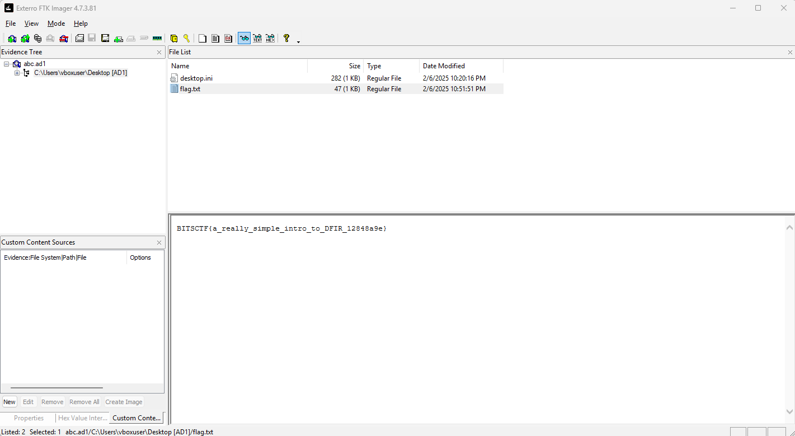

# Baby DFIR

## Description
One tool, one flag!

## Walkthrough
In this challenge we are just given a file named ` abc.ad1`. By googling we can get to know that this file is used by the tool AccessData’s FTK Imager. This is a proprietary forensic tool designed to create exact disk images, preserving the complete state of a storage device, including file system structures and unallocated space.

By just providing the tool owr file we are able to get the flag file inside it:

