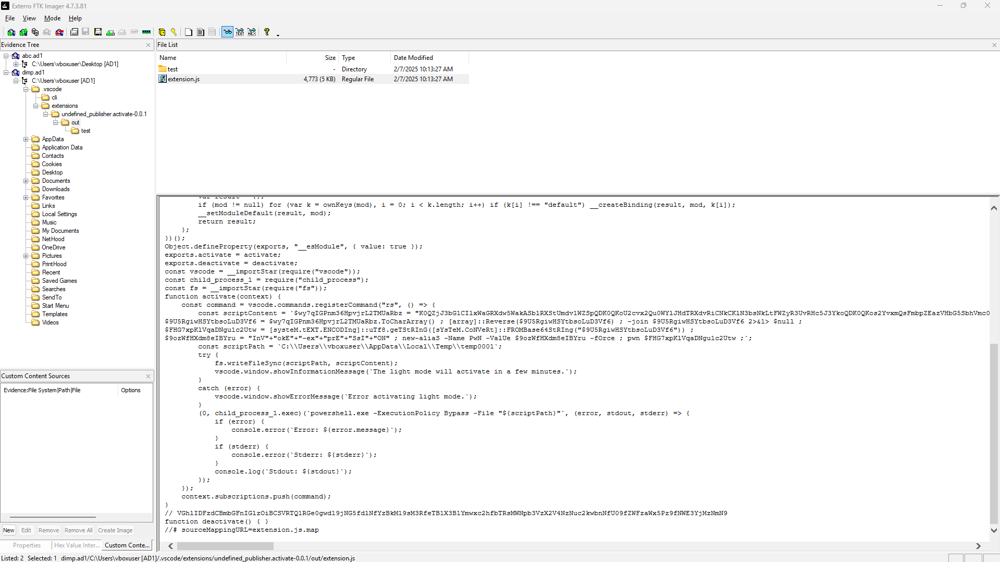
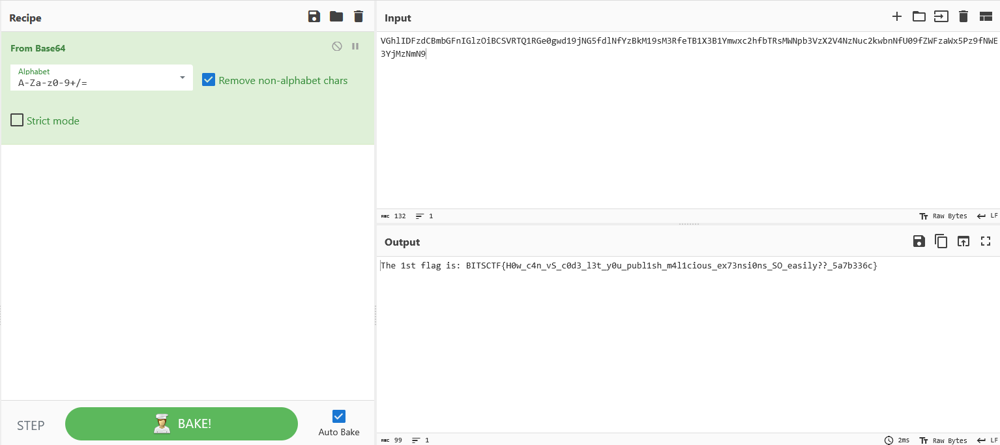

# Virus Camp 1

## Description
What did Alice really download?

## Walkthrough
Similar to the [Baby DFIR](../baby_dfir/README.md) challenge we are given a `.ad1` file which is an image file and we can open it by using FTK imager.

By looking through the filesystem we are able to see a suspicious extension that was recently added:

Within it, there is a suspicious comment that seems encoded, by [Base64](https://en.wikipedia.org/wiki/Base64) decoding it we are able to get the flag:

