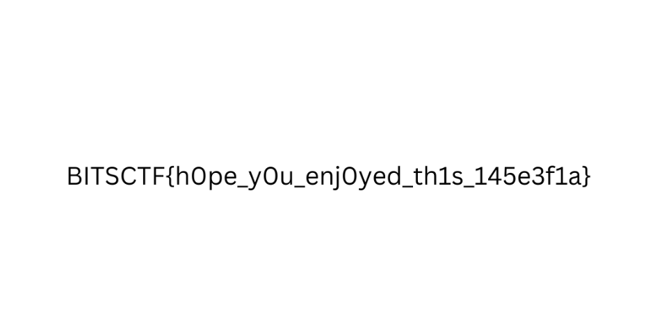

# Virus Camp 2

## Description
A light theme with dark intentions.

## Walkthrough
Previously in the [Virus Camp 1](../virus_camp_1/README.md) challenge we discovered a suspicious extension for vscode, by deobfuscating the found source code we are able to get the following:

```ps
$password = "MyS3cr3tP4ssw0rd"
$salt = [Byte[]](0x01,0x02,0x03,0x04,0x05,0x06,0x07,0x08)
$iterations = 10000
$keySize = 32   
$ivSize = 16 

$deriveBytes = New-Object System.Security.Cryptography.Rfc2898DeriveBytes($password, $salt, $iterations)
$key = $deriveBytes.GetBytes($keySize)
$iv = $deriveBytes.GetBytes($ivSize)

$inputFile = "C:\\Users\\vboxuser\\Desktop\\flag.png"
$outputFile = "C:\\Users\\vboxuser\\Desktop\\flag.enc"

$aes = [System.Security.Cryptography.Aes]::Create()
$aes.Key = $key
$aes.IV = $iv
$aes.Mode = [System.Security.Cryptography.CipherMode]::CBC
$aes.Padding = [System.Security.Cryptography.PaddingMode]::PKCS7

$encryptor = $aes.CreateEncryptor()

$plainBytes = [System.IO.File]::ReadAllBytes($inputFile)

$outStream = New-Object System.IO.FileStream($outputFile, [System.IO.FileMode]::Create)
$cryptoStream = New-Object System.Security.Cryptography.CryptoStream($outStream, $encryptor, [System.Security.Cryptography.CryptoStreamMode]::Write)

$cryptoStream.Write($plainBytes, 0, $plainBytes.Length)
$cryptoStream.FlushFinalBlock()

$cryptoStream.Close()
$outStream.Close()

Remove-Item $inputFile -Force
```

We can see that the extension encrypts the `flag.png` file by using an [AES](https://en.wikipedia.org/wiki/Advanced_Encryption_Standard) algorithm, but in this case the password and the salt are harcoded. We can therefore decrypt the flag by running the following script:
```python
import base64
import hashlib
from Crypto.Cipher import AES

# Starter config
password = "MyS3cr3tP4ssw0rd"
salt = b"\x01\x02\x03\x04\x05\x06\x07\x08"
iterations = 10000
key_size = 32
iv_size = 16

# Set iv and key
key_iv = hashlib.pbkdf2_hmac('sha1', password.encode(), salt, iterations, key_size + iv_size)
key, iv = key_iv[:key_size], key_iv[key_size:]

input_file = "./flag.enc"
output_file = "./flag.png"

# Read encrypted file
with open(input_file, "rb") as f:
    encrypted_data = f.read()

# Config AES
cipher = AES.new(key, AES.MODE_CBC, iv)
decrypted_data = cipher.decrypt(encrypted_data)

# Remove Padding PKCS7
pad_len = decrypted_data[-1]
decrypted_data = decrypted_data[:-pad_len]

# Save file
with open(output_file, "wb") as f:
    f.write(decrypted_data)

print(f"Decrypted to: {output_file}")
```

Now if we run it we are able to get the following flag:
