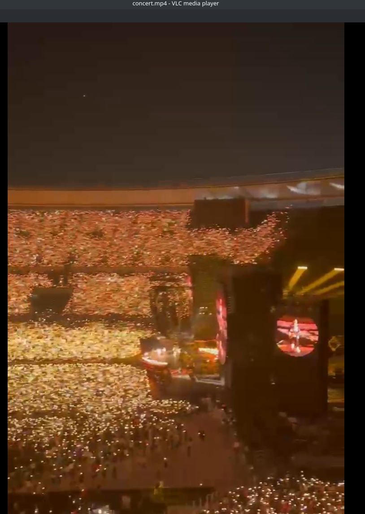
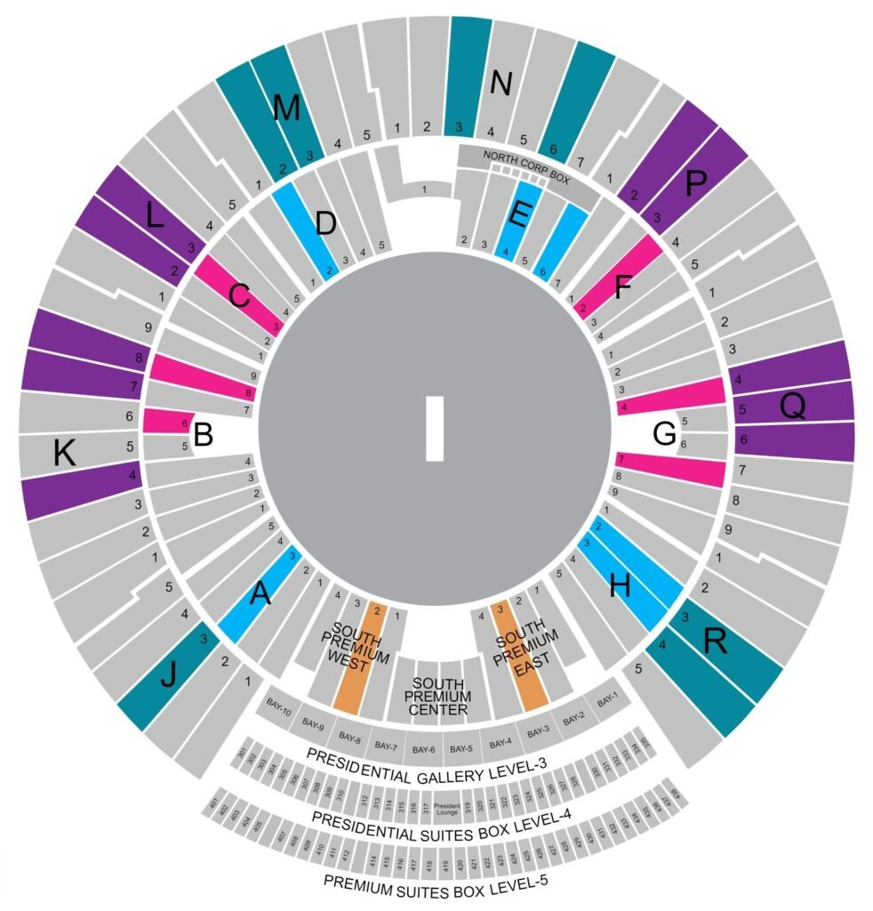

# HotPause

## Description
What even is OSINT about this?

## Walkthrough
In this challenge we are given a service IP and Port and a mp4 of a concert:



By carefully listening to the song being played we can see that the music being played is [yellow](https://en.wikipedia.org/wiki/Yellow_(Coldplay_song)) by coldplay. 

By interacting with the service we are requested the name of the city where the concert was held.

With the previous music and band in mind we can [narrow down](https://en.wikipedia.org/wiki/List_of_Coldplay_live_performances) the possible cities where the concert was held, this leads us to the answer: `AHMEDABAD`.

After answering with the right answer, we are questioned about the block letter with bay of the user who took the video.

By checking the seats placements available online:


We can either triangulate the placement or we can just brute force it... We brute force it :). After brute forcing it with "educated guesses" we come to the answer: `Q3`.

Finally after answering with the right seat we are asked to give a data stream that enables the wrist bands to light up as yellow in the video. After a quick google search we can see that this protocol was previously reversed and that the data streams are available [online](https://github.com/danielweidman/flipper-pixmob-ir-codes/blob/main/PixMob_main.ir). With this we can go through them and carefully analyse them to get the right data stream OR we can brute force it... We brute force it :). With this we can get the right answer of: `1400 1400 700 700 700 700 1400 2800 700 2100 700 700 700 1400 700 1400 1400 2800 1400 2800 700`.

Finally we can automate everything with the following script:
```python
from pwn import *
import re

context.log_level = 'critical'

# Remote Server
host = 'chals.bitskrieg.in'
port = 8000

# Helper function to interact with the process
def getFlag():
    # Step 0: Start the remote connection for each attempt
    r = remote(host, port)
    
    # Step 1: Input the city name
    r.recvuntil(b'City Name (all caps): ')
    r.sendline(b'AHMEDABAD') 
    
    # Step 2: Send block letter and bay number
    r.recvuntil(b'Block Letter with Bay(For eg. A5,B1 etc.):')
    r.sendline(b'Q3')

    # Step 3: Send data stream (https://github.com/danielweidman/flipper-pixmob-ir-codes/blob/main/PixMob_main.ir)
    r.recvuntil(b'Data Stream:')
    r.sendline(b'1400 1400 700 700 700 700 1400 2800 700 2100 700 700 700 1400 700 1400 1400 2800 1400 2800 700')
    
    # Step 4: Receive output
    output = r.recvall(timeout=2)
    r.close()
    
    # Check if flag is in output
    match = re.search(r"BITSCTF\{.*?\}", output.decode())
    if match:
        return match.group(0)
        
    return "Flag not found"

if __name__ == '__main__':
    # Retrieve flag
    print(f'[i] Flag: {getFlag()}')
```