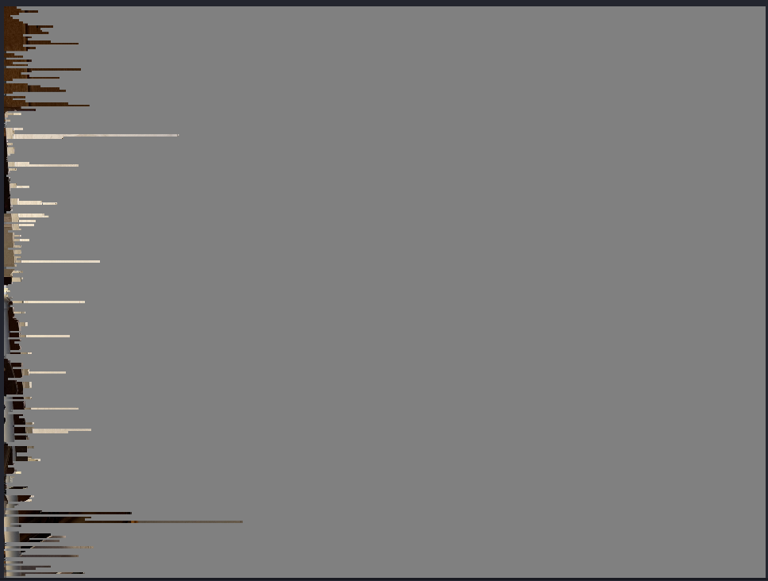
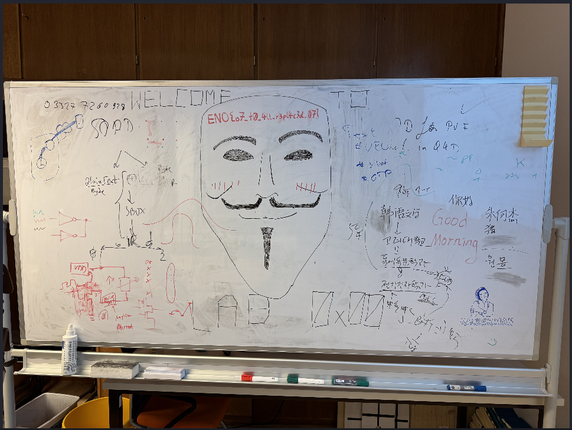

## Abroad Study Notes

- For this challenge it's given a corrupted JPEG as can be seen in the following image.

- Looking trough the hex editor it's possible to verify multiple definitions of `FF 07`
- In the JPEG Wikipedia page in the [Syntax-and-Structure section](https://en.wikipedia.org/wiki/JPEG#Syntax_and_structure)
    - Within the entropy-coded data, after any **0xFF** byte, a **0x00** byte is inserted by the encoder before the next byte, so that there does not appear to be a marker where none is intended, preventing framing errors.

- With this information we can use the `sed` command to replace all `FF 07` ocurrences with `FF 00`
    - `sed 's/\xFF\x07/\xFF\x00/g' imp0rt4nt_3tudy_n0t3s.jpg > output.jpg`

- This Results in the following image:

- Flag: `EN0{o7_t0_4ll_r3pl4c3d_07}`