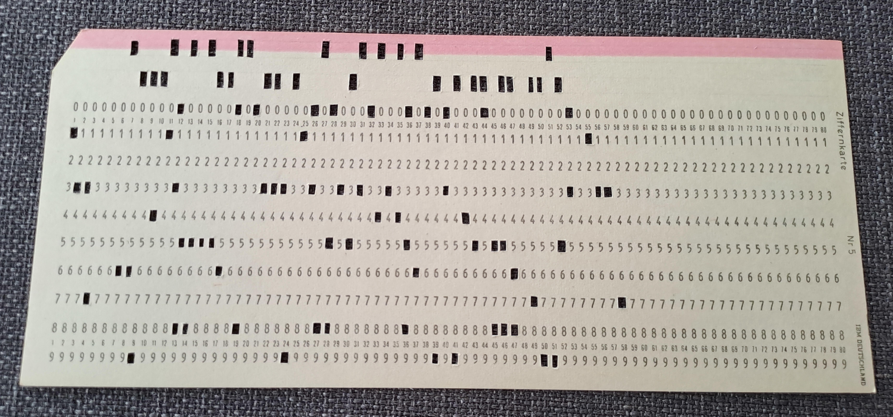

## Ancient Paper

We are given the following image:

Its a digit card. Each column its a character and each role its like the bits that form the character.
I had to learn from the following links:
- https://gen5.info/$/LU0NS2XPG8MDVCVZS
- https://codeincluded.blogspot.com/2012/07/punchcard-reader-software.html
- https://www.youtube.com/watch?v=KG2M4ttzBnY

Then we did it manually.
