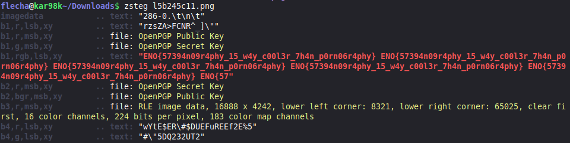

## Profound thought
We are given an image, and the description suggests that communication data might be embedded in its metadata. To retrieve some of this metadata, we can use the tool `zsteg`.
Using the following command:
`zsteg l5b245c11.png`
Retreived metadata:

