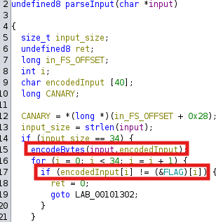
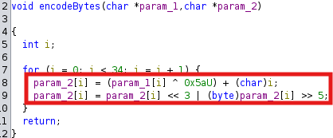

## Flag Checker

- For this challenge it is given a binary that asks us to insert the flag:

```sh
└─$ ./flag_checker 
Enter the flag: thisisnotcorrect
Incorrect!
```

- By opening the binary in Ghidra and doing some cleanup, it's possible to see how the input is being parsed, as seen in the following images.




- It's also possible to see that the encoded flag bytes are declared as a global variable. 
    - Copy Special + Python byte string

- To reverse these operations, the following steps must be followed:
    1. Define the encoded_flag bytes
    2. Loop trough the size of the flag performing the operations on each byte
        - Perform the bit shift operations in reverse order with 0xFF so we can guarantee it is in range (0-255)
        - Subtract the current loop iteration number from the byte
        - Perform the XOR with the hardcoded key
    3. Decode the result byte array

```python
encoded_flag = b'\xf8\xa8\xb8\x21\x60\x73\x90\x83\x80\xc3\x9b\x80\xab\x09\x59\xd3\x21\xd3\xdb\xd8\xfb\x49\x99\xe0\x79\x3c\x4c\x49\x2c\x29\xcc\xd4\xdc'

encoded_flag = bytearray(encoded_flag)
decoded_flag = bytearray(len(encoded_flag))

for i in range(len(encoded_flag)):
    byte = encoded_flag[i]
    byte = ((byte >> 3) | (byte << 5)) & 0xFF  
    byte = (byte - i) & 0xFF 
    byte = byte ^ 0x5A
    decoded_flag[i] = byte

print(decoded_flag.decode(errors='ignore'))
```

- Flag - `ENO{R3V3R53_3NG1N33R1NG_M45T3R!!!}`