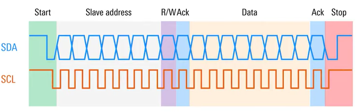

## Oscilloscope

- Trough the name of the challenge and description it is possible to imediatlly deduce we will need to process some logic data

- For the challenge it is given a pickle file that when parsed it is possible to see 280000 table rows
    - From the three initial values of each column, represented in the following images is possible to deduce
        1. First row must refer to time because of the small differences between each one
        2. Second and third row must refer to voltage do to being close to the `3.3` value which is very common in multiple devices


- Knowing this the next step must be to plot the data
    - Since we have two rows that seem to have voltage levels we can plot them in different graphs giving the following graphs


- The code to plot this data is the following

```python
import pickle
import matplotlib.pyplot as plt

with open('trace.pckl', 'rb') as f:
    data = pickle.load(f)

time = data[0]
voltage = data[1]
intensity = data[2]

print("First Value: ", data[0][0], " | Second Value: ", data[0][1], " | Third Value: ", data[0][2], " | Size:", len(data[0]))  # Time
print("First Value: ", data[1][0], " | Second Value: ", data[1][1], " | Third Value: ", data[1][2], " | Size:", len(data[1]))  # Voltage - Amplitude
print("First Value: ", data[2][0], " | Second Value: ", data[2][1], " | Third Value: ", data[2][2], " | Size:", len(data[2]))  # Intensity - Trigger Point

def plot_data():
    fig, ax = plt.subplots(2, 1, figsize=(10, 6), sharex=True)

    ax[0].plot(time, voltage, label="Clock", color="blue", lw=1)
    ax[0].set_xlabel('Time (s)')
    ax[0].set_ylabel('Voltage (V)')
    ax[0].set_title('Clock Signal (Voltage) vs Time')
    ax[0].grid(True)
    ax[0].legend(loc="upper right")

    ax[1].plot(time, intensity, label="Data", color="red", lw=1)
    ax[1].set_xlabel('Time(s)')
    ax[1].set_ylabel('Voltage (V)')
    ax[1].set_title('Data Transmission (Voltage) vs Time')
    ax[1].grid(True)
    ax[1].legend(loc="upper right")

    plt.tight_layout()
    plt.show()

plot_data()
```

- If we zoom in it possible to perceive that the first graph seems like a **clock** and the second one looks like **data**
    - With this information we can deduce this is a serial protocol, and from using a single data and clock line we can assume this is I2C


- Looking at this [video](https://www.youtube.com/watch?v=CAvawEcxoPU) we can understand the structure of I2C data transmission
    - An example from the video can be seen in the following image



- For this challenge since the data was small i decided to go frame by frame and take the binary data from it. An example of how the data tranmission starts and how the letter `E` was transmitted can be seen in the following image


- Doing this for a while we get the following binary data that can be decoded giving us the flag.
```sh
01000101
01001110
01001111
01111011
01010011
00110000
01011111
01010100
01001000
00110001
00110101
01011111
00110001
00110101
01011111
01001000
00110000
01010111
01011111
01011001
00110000
01010101
01011111
01000100
00110011
01000011
00110000
01000100
00110011
01011111
01001001
00110010
01000011
01111101
```

- Flag - `ENO{S0_TH15_15_H0W_Y0U_D3C0D3_I2C}`